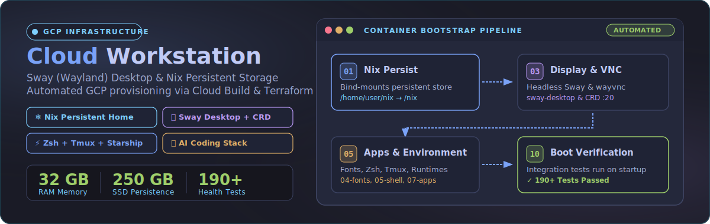

<p align="center">
  
</p>

# GCP Cloud Workstation

A high-performance, turn-key cloud development workspace designed to eliminate local environment drift and manual machine setup. Unlike standard cloud VMs or default cloud workstations, this environment delivers immediate out-of-the-box (OOTB) productivity on Google Cloud Platform—pre-configured with a low-latency Sway (Wayland) tiling desktop, durable Nix store persistence across container rebuilds, Antigravity Hub, the `agy` CLI, and pre-installed VS Code. Seamlessly accessible via web browser or Chrome Remote Desktop, it comes equipped with 190+ automated boot health verification tests and fully tuned developer tooling ready from first boot.

---

## What's Included

| Component | Technical Details |
|:---|:---|
| **Compute Machine** | `n2-standard-8` (8 vCPU, 32 GB RAM) on GCP Cloud Workstations |
| **Storage & Persistence** | 250 GB Persistent SSD mounted at `/home/user` (survives container teardown & rebuilds) |
| **Desktop Environment** | Headless Sway (Wayland) with Tokyo Night theme, accessible via Browser & Chrome Remote Desktop |
| **Terminal & Shell** | `foot` terminal, Zsh shell, Starship prompt, crash-resistant tmux multiplexer |
| **Typography & Fonts** | JetBrains Mono, Fira Code, Cascadia Code, DejaVu Sans Mono |
| **Development Runtimes** | Go (latest), Rust (`rustup`), Python 3.12 (`pyenv`), Ruby 3.3 (`rbenv`), Node.js 22 (Nix) |
| **Editors & IDEs** | Antigravity IDE, VS Code, Neovim (Tokyo Night pre-configured) |
| **AI Developer Tools** | Antigravity Hub, Antigravity CLI |
| **System Tools** | `ripgrep`, `fd`, `jq`, `ffmpeg`, `wofi`, `thunar`, `clipman` |
| **Health Verification** | 190+ automated integration tests executed on every system startup |

---

## How It Works

The Cloud Workstation container runs a minimal Ubuntu base image while storing all packages, language runtimes, user dotfiles, and configurations on a 250GB persistent SSD disk mounted to `/home/user`. 

On every workstation boot, the system executes an automated sequence of numbered bootstrap scripts (`workstation-image/boot/01-12*.sh`):

1. **Nix Restoration (`01-nix.sh`):** Bind-mounts persistent storage from `/home/user/nix` to `/nix` so all Nix packages survive container rebuilds.
2. **GPU Driver Configuration (`02-nvidia.sh`):** Configures host NVIDIA drivers when a GPU is attached.
3. **Display & Desktop Services (`03-sway.sh`):** Starts headless `sway-desktop` and `wayvnc` user services on display `:20`.
4. **Developer Fonts (`04-fonts.sh`):** Installs JetBrains Mono, Fira Code, Cascadia Code, and custom developer fonts to persistent storage.
5. **Shell & Terminal (`05-shell.sh`, `06-prompt.sh`):** Provisions ZSH, Starship prompt, `foot` terminal, and Tokyo Night visual tokens.
6. **Tmux Multiplexer (`06b-tmux.sh`):** Configures crash-resistant tmux with custom keybindings and helper wrappers.
7. **Apps & Language Runtimes (`07-apps.sh`, `07a-lang-deps.sh`, `07b-languages.sh`):** Manages Go, Rust, Python, Ruby, and Node.js versions.
8. **Workspace Auto-Launch (`08-workspaces.sh`):** Automatically initializes workspace layouts (Antigravity IDE on WS1, VS Code on WS2, Terminal on WS3, Chrome on WS4).
9. **Configuration Sync (`09-sync.sh`):** Synchronizes boot scripts and Sway configurations directly from git on boot.
10. **Environment Health Verification (`10-tests.sh`):** Runs 190+ automated integration tests to ensure workspace health.

---

## Quick Start

### Prerequisites

1. A GCP project with **Owner** role (or permissions: `workstations.admin`, `artifactregistry.admin`, `compute.admin`, `cloudbuild.builds.editor`, `iam.serviceAccountUser`).
2. [Terraform](https://developer.hashicorp.com/terraform/downloads) (>= 1.0) and `gcloud` CLI installed locally.
3. **GCP Auth:** Run `gcloud auth login` and `gcloud auth application-default login`.

### Deployment Options

```
                              ┌────────────────────────────────────────┐
                              │    Choose a Setup Path                 │
                              └──────────────────┬─────────────────────┘
                                                 │
                        ┌────────────────────────┴────────────────────────┐
                        ▼                                                 ▼
        ┌───────────────────────────────┐                 ┌───────────────────────────────┐
        │  Path A: Fully Automated      │                 │  Path B: Terraform + Scripts  │
        │  (Recommended for CI/CD)      │                 │  (Custom Infra Control)       │
        └───────────────┬───────────────┘                 └───────────────┬───────────────┘
                        │                                                 │
                        ▼                                                 ▼
        `bash scripts/ws.sh setup`                        `cd terraform && terraform apply`
        (Runs in Cloud Build)                             `bash scripts/deploy-configs.sh`
```

#### Path A: Fully Automated (`ws.sh setup`) — Recommended

Executes infrastructure creation and container provisioning in Cloud Build.

```bash
bash scripts/ws.sh setup -p YOUR_PROJECT_ID
```

This single command automatically provisions:
- GCP API Enablement & Artifact Registry creation
- VPC Network, Subnet, Cloud Router, and Cloud NAT
- Custom Docker image build & Cloud Workstations Cluster / Config / Machine setup
- Disk snapshot policy for daily backups & Cloud Scheduler auto-stop job

#### Path B: Terraform + Cloud Build

Use Terraform for explicit infrastructure management, then execute software provisioning scripts:

```bash
# Step 1: Provision Network & Artifact Registry
cd terraform
terraform init
terraform apply -var="project_id=YOUR_PROJECT_ID" \
  -target=google_compute_network.workstations_vpc \
  -target=google_compute_subnetwork.workstations_subnet \
  -target=google_compute_router.workstations_router \
  -target=google_compute_router_nat.workstations_nat \
  -target=google_artifact_registry_repository.workstation_images

# Step 2: Build & Push Container Image
cd ..
gcloud builds submit workstation-image/ \
  --tag="us-central1-docker.pkg.dev/YOUR_PROJECT_ID/workstation-images/dev-workstation:latest" \
  --project="YOUR_PROJECT_ID" --region="us-central1"

# Step 3: Complete Terraform Infrastructure
cd terraform
terraform apply -var="project_id=YOUR_PROJECT_ID"

# Step 4: Deploy Configuration & Initialize Nix Store
cd ..
bash scripts/deploy-configs.sh -p YOUR_PROJECT_ID
```

### Custom Resource Naming

Customize resource names across both setup paths using flags:

```bash
bash scripts/ws.sh setup -p YOUR_PROJECT_ID \
  --cluster main-cluster \
  --config dev-config \
  --workstation dev-workstation
```

---

## Desktop & Workspace Access

### Connecting via Browser

Retrieve the direct web workstation URL:

```bash
gcloud workstations describe dev-workstation \
  --cluster=workstation-cluster \
  --config=ws-config \
  --region=us-central1 \
  --project=YOUR_PROJECT_ID \
  --format="value(host)"
```

Open the returned URL in Google Chrome.

### Chrome Remote Desktop (CRD) Setup

For high-framerate remote desktop access:

1. SSH into the workstation:
   ```bash
   gcloud workstations ssh dev-workstation --cluster=workstation-cluster --region=us-central1 --project=YOUR_PROJECT_ID
   ```
2. Run the interactive CRD setup utility:
   ```bash
   setup-crd.sh
   ```
3. Follow terminal prompts: navigate to [remotedesktop.google.com/headless](https://remotedesktop.google.com/headless), authorize, copy the Debian command into the SSH terminal, and set a 6-digit PIN.
4. Access via [remotedesktop.google.com/access](https://remotedesktop.google.com/access) and adjust resolution:
   ```bash
   crd-resize 2560 1440
   ```

### Antigravity Hub (hub-restart)

The Antigravity Hub desktop application is pre-installed out-of-the-box, but it is deliberately not auto-launched on system boot to prevent blank-screen rendering failures before an active user session and X11/Wayland display environment are fully established.

To start the Hub once connected via Chrome Remote Desktop:

1. Switch to Workspace 3 (terminal).
2. Execute the launcher command:
   ```bash
   hub-restart
   ```

What `hub-restart` does:
- **Terminates stuck processes:** Kills any hanging or stuck Hub processes.
- **Clears singleton locks:** Clears stale singleton locks to enable a clean application start.
- **Relaunches in Wayland session:** Spawns Antigravity Hub inside the active Wayland display session (`DISPLAY=:20`).
- **Focuses Workspace 5:** Automatically places the Hub window onto Workspace 5 (`ws5`) and sets display focus directly to Workspace 5.

---

## Keyboard Shortcuts

All Sway desktop navigation shortcuts use `CTRL+SHIFT` as the modifier key to ensure seamless compatibility with web browsers and remote desktop clients:

| Keybinding | Action |
|:---|:---|
| `CTRL+SHIFT+Enter` / `CTRL+SHIFT+T` | Open Terminal (`foot`) |
| `CTRL+SHIFT+B` | Launch Google Chrome |
| `CTRL+SHIFT+Y` | Launch VS Code |
| `CTRL+SHIFT+R` | Open App Launcher (`wofi`) |
| `CTRL+SHIFT+A` | Open Clipboard History (`clipman`) |
| `CTRL+SHIFT+S` | Open Interactive Snippet Picker |
| `CTRL+SHIFT+E` | Open File Manager (`thunar`) |
| `CTRL+SHIFT+D` | Toggle Window Floating State |
| `CTRL+SHIFT+Q` | Close Active Window |
| `CTRL+SHIFT+F` | Toggle Fullscreen Mode |
| `CTRL+SHIFT+H / I / O / P` | Switch to Workspace 1 / 2 / 3 / 4 |
| `CTRL+SHIFT+U / J / K / L` | Switch to Workspace 5 / 6 / 7 / 8 |
| `CTRL+SHIFT+Alt+H / I / O / P` | Move Focused Window to Workspace 1 / 2 / 3 / 4 |
| `CTRL+SHIFT+Alt+U / J / K / L` | Move Focused Window to Workspace 5 / 6 / 7 / 8 |
| `CTRL+SHIFT+Arrow Keys` | Move Focus Left / Right / Up / Down |
| `CTRL+SHIFT+,` / `CTRL+SHIFT+.` | Grow / Shrink Window Width |
| `CTRL+SHIFT+-` / `CTRL+SHIFT+=` | Shrink / Grow Window Height |
| `CTRL+SHIFT+Escape` | Exit Sway Desktop Session |

---

## Language Version Management

Language runtimes use dedicated version managers installed on persistent home storage:

| Language | Version Manager | Usage Command |
|:---|:---|:---|
| **Python** | `pyenv` | `pyenv install 3.12.0 && pyenv global 3.12.0` |
| **Ruby** | `rbenv` | `rbenv install 3.3.0 && rbenv global 3.3.0` |
| **Rust** | `rustup` | `rustup update stable && rustup default stable` |
| **Go** | Binary Release | Installed directly to `/home/user/.local/go` |
| **Node.js** | Nix Home Manager | Managed persistently via `home-manager switch` |

---

## Automated Boot Integration Tests

Every system boot triggers an extensive integration test suite (`workstation-image/boot/10-tests.sh`) to verify environment health.

Log outputs are saved to:
- `~/logs/boot-test-results.txt`: Comprehensive PASS / FAIL status for each module.
- `~/logs/boot-test-summary.txt`: Single-line summary (e.g., `PASS: 190 | FAIL: 0 | WARN: 0`).

Run tests manually at any time:

```bash
bash /home/user/boot/10-tests.sh
```

---

## Troubleshooting

| Issue | Cause | Solution |
|:---|:---|:---|
| **Port 80 Connection Error** | Initial Language Compilation | On fresh deployments, language runtimes compile optimized binaries on first boot (takes 10-15 mins). Wait for bootstrap completion. |
| **CRD Session Black Screen** | Sway Service Starting | Wait 30 seconds after starting workstation for Sway and `wayvnc` systemd services to finish initializing. |
| **Missing AI Credentials** | `~/.env` Not Sourced | Ensure API keys are set in `~/.env`. The shell auto-sources this file on startup. |
| **Quota Exceeded Error** | GCP Regional Quotas | Request `NVIDIA_T4_GPUS` or CPU quota in target region via [GCP IAM Quotas](https://console.cloud.google.com/iam-admin/quotas). |

---

## Teardown & Cleanup

To destroy all provisioned GCP infrastructure (workstation, cluster, container repository, Cloud Scheduler):

```bash
bash scripts/ws.sh teardown -p YOUR_PROJECT_ID -y
```

---

## License

Provided under the [Apache 2.0](https://www.apache.org/licenses/LICENSE-2.0) license. See the [LICENSE](./LICENSE.txt) file.

*This is not an officially supported Google product, nor is it part of an official Google product.*

## Acknowledgments

This project is an independent standalone repository based on the original work by [ameer00](https://github.com/ameer00) - [cloud-workstations](https://github.com/ameer00/cloud-workstations).

